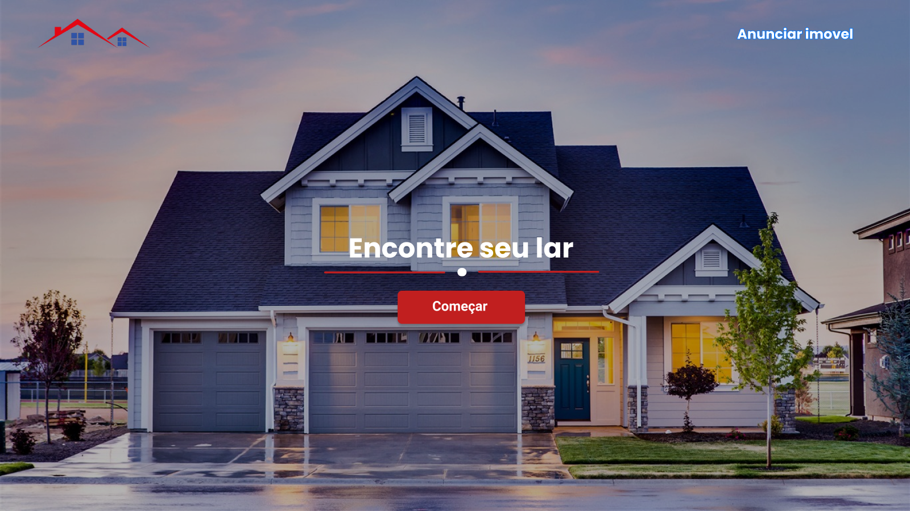
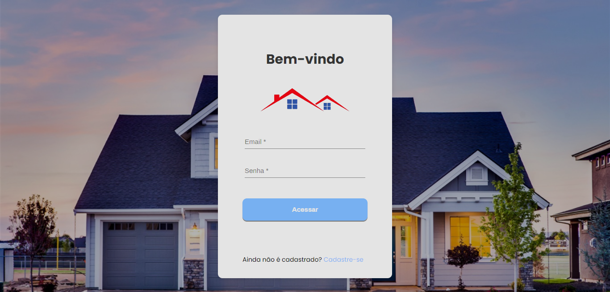

<p align="center">
  
</p>

<h1 align="center">Imobiliária</h1>

## Qual o objetivo deste projeto? 🤔

Na disciplina de Projetos Aplicados II da faculdade com uma equipe formada por três pessoas tinhamos o objetivo de criar um sistema para uso real. O sistema que escolhemos foi este, uma imobiliária de venda e aluguel de casas.<br /> <br />

<div align="center">
  <br>
    
  <br>
</div>

## O que foi desenvolvido? 🚀

Página web mostrando o projeto concluído.<br />
Disponível [aqui](https://imobiliaria.vercel.app/welcome)
<br/>
<small><b>Obs:</b> A visualização ainda não está disponível no mobile.</small>

<div align="center">
  <br>
    
  <br>
</div>

## Demonstração 🎥


#### Você pode ver a galeria de imagens de todo o projeto [aqui](https://www.figma.com/file/4M6Dvk38tt16zzbcstvtDC/Projeto-PA-2?node-id=152%3A2)

## Tecnologias usadas 📚

- HTML5
- CSS3
- Angular
- TypeScript
- Angular Material
- NG-ZORRO
- Spring Boot
- Docker Compose
- Azure DevOps Server

## Desenvolvimento 🎬

Clonando o repositório:

```
git clone https://github.com/DanielSoaresRocha/Imobiliaria.git
```

Navegando até a pasta do repositório:

```
cd Imobiliaria
```

### Frontend ✨

Baixando as dependências

```
npm i
```

<small>ou</small>

```
yarn
```

Rodando o projeto

```
yarn start
```

## License 📝

This project is licensed under the [MIT License](https://opensource.org/licenses/MIT) - see the [LICENSE](LICENSE) file for details.

## Autores

<table>
  <tr>
    <td align="center"><a href="https://github.com/DanielSoaresRocha"><br /><sub><b>Daniel Soares</b></sub></a>
    <br />
    <a href="https://github.com/DanielSoaresRocha/Imobiliaria/commits?author=DanielSoaresRocha" title="Code">💻</a>
    <a href="https://www.figma.com/file/4M6Dvk38tt16zzbcstvtDC/Projeto-PA-2?node-id=152%3A2" title="Designer">✨</a>
    </td>
    <td align="center"><a href="https://github.com/WesleyLeocadio"><br /><sub><b>Weslley Leocadio</b></sub></a>
    <br />
    <a href="https://github.com/DanielSoaresRocha/Imobiliaria/commits?author=WesleyLeocadio" title="Code">💻</a>
    </td>
    <td align="center"><a href="https://github.com/pedrofnsc1"><br /><sub><b>Pedro Ricardo</b></sub></a>
    <br />
    <a href="https://github.com/DanielSoaresRocha/Imobiliaria/commits?author=pedrofnsc1" title="Code">💻</a>
    <a href="https://www.figma.com/file/4M6Dvk38tt16zzbcstvtDC/Projeto-PA-2?node-id=152%3A2" title="Designer">✨</a>
    </td>
    </td>
  <tr>
</table>
